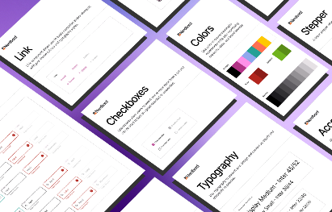
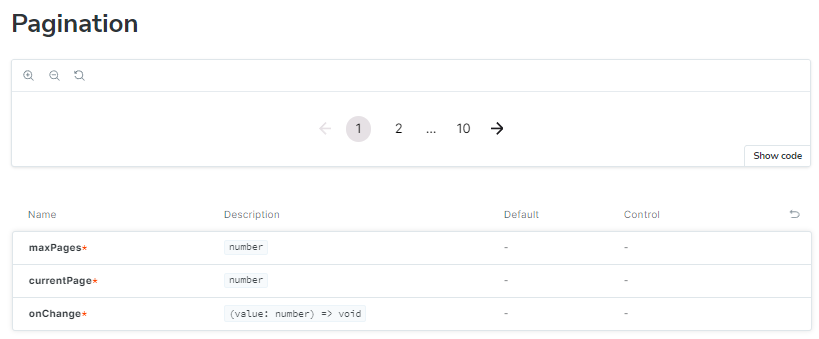
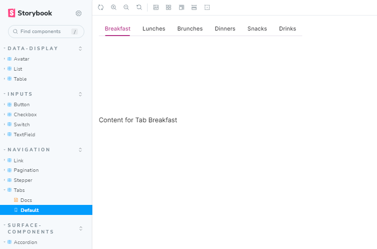
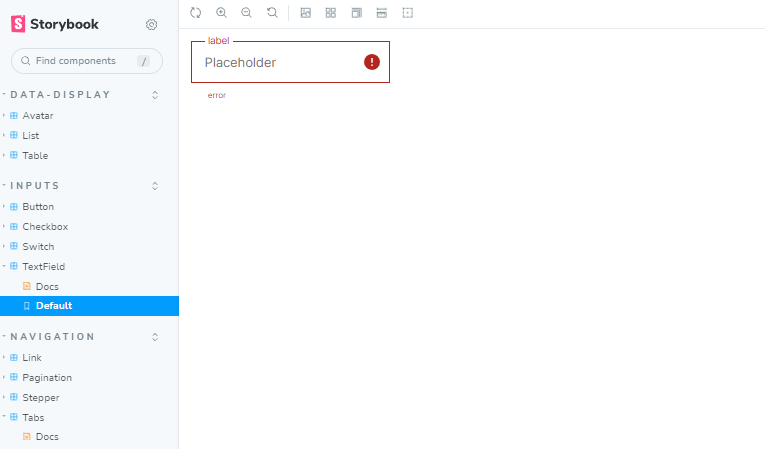

<h1 align="center">
  Nerdux-UI System
  <p align="center">
    
  </p>
</h1>
<p align="center">
  <a href="#introduction">Introduction</a> •
  <a href="#features">Features</a> •
  <a href="#technologies">Technologies</a> •
  <a href="#getting-started">Getting Started</a> •
  <a href="#testing">Testing</a> •
  <a href="#storybook">Storybook</a> •
  <a href="#credits">Credits</a>
</p>
<br><br><br>

## Introduction

Nerdux-UI is a comprehensive library of reusable React components, designed to offer consistency in design and user experience across applications. It emphasizes reusability and modularity, improving maintainability and scalability of the codebase. This library is perfect for developers looking to reduce development time and effort while ensuring high-quality and robust UI components.
<br><br>

## Features

**· Inputs:** Button, Checkbox, Switch, TextField

**· Data Display:** Avatar, List, Table

**· Navigation:** Link, Pagination, Stepper, Tabs

**· Surface Components:** Accordion, Card
<br><br>

## Technologies

**·React.js**

**·TypeScript**

**·CSS Modules**

**·Storybook**

**·Jest**

<br><br>

## Getting Started

**1. Clone the Repository**

```bash
https://github.com/wawrzonnn/ui-system.git
```

**2. Install Dependencies**

```bash
npm install
```

**3. Run the Application**

```bash
npm run storybook
```

Visit **http://localhost:6006/** to view the component library.
<br><br>

## Testing

**· Run Tests**

```bash
npm run test
```

Tests are written using Jest and React Testing Library to ensure component reliability and functionality.
<br><br>

## Live Demo

Experience eDashboard in action: [Live Demo Link](https://ui-system-oad1.vercel.app/?path=/story/inputs-switch--default)
<br><br>

## Screenshots

#### ◇ Pagination

<p align="center">
  <a href="./docs/nerdux1Big.png">
    
  </a>
</p>

#### ◇ Tabs

<p align="center">
  <a href="./docs/nerduxBig2.png">
    
  </a>
</p>

#### ◇ TextField

<p align="center">
  <a href="./docs/nerdux3Big.png">
    
  </a>
</p>
<br><br>

## Credits

Design provided by [Nerdbord.io](https://nerdbord.io).
